# 🏗️ Architecture Technique - Sama Jokoo

## 📋 Vue d'Ensemble

Sama Jokoo est conçu comme une solution hybride combinant :
- **Backend Odoo** : Gestion des données et logique métier
- **Frontend Flutter** : Application mobile native
- **API REST** : Communication sécurisée
- **Intégrations** : Modules Odoo existants

## 🎯 Objectifs Architecturaux

### Scalabilité
- Support de milliers d'utilisateurs simultanés
- Architecture modulaire et extensible
- Cache distribué avec Redis

### Performance
- Pagination intelligente des feeds
- Compression et optimisation des médias
- Lazy loading des contenus

### Sécurité
- Authentification robuste
- Permissions granulaires
- Chiffrement des communications

### Intégration
- Compatibilité totale avec Odoo 18 CE
- Réutilisation des modules existants
- Migration des données facilitée

## 🗄️ Modèle de Données

### Diagramme ERD


### Relations Clés

#### Posts Sociaux
- **Auteur** : Lien vers res.users
- **Visibilité** : public, followers, private, company
- **Médias** : Images, vidéos, documents
- **Hashtags** : Tags pour catégorisation
- **Mentions** : Références à d'autres utilisateurs

#### Système de Suivi
- **Followers** : Utilisateurs qui suivent
- **Following** : Utilisateurs suivis
- **États** : pending, accepted, blocked

#### Notifications
- **Types** : like, comment, mention, follow, system
- **Données** : JSON pour informations supplémentaires
- **Statut** : lu/non lu avec horodatage

## 🔄 Flux de Données

### Création d'un Post

```mermaid
sequenceDiagram
    participant Mobile as App Mobile
    participant API as API REST
    participant Odoo as Backend Odoo
    participant DB as PostgreSQL
    participant Cache as Redis
    
    Mobile->>API: POST /api/social/posts
    API->>Odoo: Validation & Création
    Odoo->>DB: Sauvegarde post
    Odoo->>Odoo: Extraction hashtags/mentions
    Odoo->>DB: Création notifications
    Odoo->>Cache: Invalidation cache feed
    API->>Mobile: Réponse succès
    
    Note over Odoo: Traitement asynchrone
    Odoo->>Odoo: Traitement médias
    Odoo->>Odoo: Envoi notifications push
```



### Récupération du Feed

```mermaid
sequenceDiagram
    participant Mobile as App Mobile
    participant API as API REST
    participant Cache as Redis
    participant Odoo as Backend Odoo
    participant DB as PostgreSQL
    
    Mobile->>API: GET /api/social/posts
    API->>Cache: Vérification cache
    
    alt Cache Hit
        Cache->>API: Données en cache
        API->>Mobile: Feed posts
    else Cache Miss
        API->>Odoo: Requête feed
        Odoo->>DB: Query posts + permissions
        DB->>Odoo: Résultats
        Odoo->>API: Posts formatés
        API->>Cache: Mise en cache
        API->>Mobile: Feed posts
    end
```



## 🔐 Sécurité

### Authentification

#### Session Odoo (Web)
```python
# Authentification standard Odoo
@http.route('/web/session/authenticate', type='json', auth="none")
def authenticate(self, db, login, password, base_location=None):
    # Logique d'authentification Odoo
    pass
```

#### Token API (Mobile)
```python
# JWT Token pour mobile (optionnel)
import jwt
from datetime import datetime, timedelta

def generate_token(user_id):
    payload = {
        'user_id': user_id,
        'exp': datetime.utcnow() + timedelta(hours=24),
        'iat': datetime.utcnow()
    }
    return jwt.encode(payload, SECRET_KEY, algorithm='HS256')
```

### Permissions

#### Règles de Sécurité
```xml
<!-- Visibilité des posts selon les règles métier -->
<record id="social_post_rule_user" model="ir.rule">
    <field name="domain_force">[
        '|', '|', '|',
        ('author_id', '=', user.id),
        ('visibility', '=', 'public'),
        ('visibility', '=', 'company'),
        '&', ('visibility', '=', 'followers'), 
             ('author_id.social_followers.follower_id', '=', user.id)
    ]</field>
</record>
```

#### Contrôle d'Accès
```python
# Vérification des permissions au niveau modèle
def check_access_rights(self, operation, raise_exception=True):
    if operation == 'write':
        if not self.user_can_edit:
            raise AccessError(_("Vous ne pouvez pas modifier ce post"))
    return super().check_access_rights(operation, raise_exception)
```

## 📱 Architecture Mobile

### Structure Flutter

```
lib/
├── core/
│   ├── config/          # Configuration app
│   ├── constants/       # Constantes
│   ├── errors/          # Gestion erreurs
│   └── utils/           # Utilitaires
├── data/
│   ├── datasources/     # Sources de données
│   ├── models/          # Modèles de données
│   └── repositories/    # Repositories
├── domain/
│   ├── entities/        # Entités métier
│   ├── repositories/    # Interfaces repositories
│   └── usecases/        # Cas d'usage
├── presentation/
│   ├── bloc/            # State management
│   ├── pages/           # Pages/Écrans
│   └── widgets/         # Widgets réutilisables
└── main.dart
```

### State Management (BLoC)

```dart
// Post BLoC pour gestion d'état
class PostBloc extends Bloc<PostEvent, PostState> {
  final PostRepository repository;
  
  PostBloc({required this.repository}) : super(PostInitial()) {
    on<LoadPosts>(_onLoadPosts);
    on<CreatePost>(_onCreatePost);
    on<LikePost>(_onLikePost);
  }
  
  Future<void> _onLoadPosts(LoadPosts event, Emitter<PostState> emit) async {
    emit(PostLoading());
    try {
      final posts = await repository.getPosts(
        limit: event.limit,
        offset: event.offset
      );
      emit(PostLoaded(posts: posts));
    } catch (e) {
      emit(PostError(message: e.toString()));
    }
  }
}
```

### Services API

```dart
class SocialApiService {
  final Dio _dio;
  final String baseUrl;
  
  SocialApiService({required this.baseUrl}) : _dio = Dio() {
    _dio.interceptors.add(AuthInterceptor());
    _dio.interceptors.add(LoggingInterceptor());
  }
  
  Future<ApiResponse<List<Post>>> getPosts({
    int limit = 20,
    int offset = 0,
    String filter = 'all'
  }) async {
    try {
      final response = await _dio.get('/posts', queryParameters: {
        'limit': limit,
        'offset': offset,
        'filter': filter,
      });
      
      return ApiResponse.fromJson(
        response.data,
        (data) => (data as List).map((e) => Post.fromJson(e)).toList()
      );
    } catch (e) {
      throw ApiException.fromDioError(e);
    }
  }
}
```

## 🚀 Performance

### Optimisations Backend

#### Cache Redis
```python
import redis
from odoo import tools

class SocialPost(models.Model):
    _name = 'social.post'
    
    @tools.ormcache('user_id', 'limit', 'offset')
    def get_feed_cached(self, user_id, limit=20, offset=0):
        """Feed avec cache Redis"""
        cache_key = f"social_feed:{user_id}:{limit}:{offset}"
        
        # Vérifier le cache
        cached_data = redis_client.get(cache_key)
        if cached_data:
            return json.loads(cached_data)
        
        # Générer les données
        feed_data = self._generate_feed(user_id, limit, offset)
        
        # Mettre en cache (5 minutes)
        redis_client.setex(cache_key, 300, json.dumps(feed_data))
        
        return feed_data
```

#### Optimisation Requêtes
```python
def get_feed(self, limit=20, offset=0, filter_type='all'):
    """Feed optimisé avec prefetch"""
    domain = [('state', '=', 'published')]
    
    posts = self.search(domain, limit=limit, offset=offset)
    
    # Prefetch des relations pour éviter N+1
    posts.read(['author_id', 'like_count', 'comment_count'])
    posts.mapped('author_id.name')  # Prefetch noms auteurs
    posts.mapped('media_ids.media_type')  # Prefetch médias
    
    return posts
```

### Optimisations Frontend

#### Lazy Loading
```dart
class PostListWidget extends StatefulWidget {
  @override
  _PostListWidgetState createState() => _PostListWidgetState();
}

class _PostListWidgetState extends State<PostListWidget> {
  final ScrollController _scrollController = ScrollController();
  
  @override
  void initState() {
    super.initState();
    _scrollController.addListener(_onScroll);
  }
  
  void _onScroll() {
    if (_scrollController.position.pixels == 
        _scrollController.position.maxScrollExtent) {
      // Charger plus de posts
      context.read<PostBloc>().add(LoadMorePosts());
    }
  }
  
  @override
  Widget build(BuildContext context) {
    return ListView.builder(
      controller: _scrollController,
      itemBuilder: (context, index) {
        return PostWidget(post: posts[index]);
      },
    );
  }
}
```

#### Cache Images
```dart
// Configuration cache images
CachedNetworkImage(
  imageUrl: post.imageUrl,
  placeholder: (context, url) => ShimmerWidget(),
  errorWidget: (context, url, error) => Icon(Icons.error),
  cacheManager: CustomCacheManager(),
  maxHeightDiskCache: 1000,
  maxWidthDiskCache: 1000,
)
```

## 🔄 Intégrations

### Modules Odoo

#### Mail Thread
```python
class MailThread(models.AbstractModel):
    _inherit = 'mail.thread'
    
    def _message_post_after_hook(self, message, msg_vals):
        """Auto-création de posts sociaux"""
        result = super()._message_post_after_hook(message, msg_vals)
        
        if (self.social_allow_posts and 
            message.message_type == 'comment' and 
            not message.is_internal):
            self._create_social_post_from_message(message)
        
        return result
```

#### Project Integration
```python
class ProjectTask(models.Model):
    _inherit = 'project.task'
    
    def write(self, vals):
        result = super().write(vals)
        
        # Post automatique pour changement d'étape
        if 'stage_id' in vals:
            self._create_stage_change_post(vals['stage_id'])
        
        return result
    
    def _create_stage_change_post(self, new_stage_id):
        stage = self.env['project.task.type'].browse(new_stage_id)
        content = f"📋 Tâche '{self.name}' déplacée vers '{stage.name}'"
        
        self.env['social.post'].create({
            'content': content,
            'author_id': self.env.user.id,
            'res_model': self._name,
            'res_id': self.id,
            'visibility': 'company',
        })
```

### Visioconférences

#### Jitsi Meet Integration
```python
class CalendarEvent(models.Model):
    _inherit = 'calendar.event'
    
    jitsi_room_id = fields.Char('Room Jitsi')
    jitsi_url = fields.Char('URL Jitsi', compute='_compute_jitsi_url')
    
    @api.depends('jitsi_room_id')
    def _compute_jitsi_url(self):
        jitsi_domain = self.env['ir.config_parameter'].get_param('jitsi.domain')
        for event in self:
            if event.jitsi_room_id and jitsi_domain:
                event.jitsi_url = f"https://{jitsi_domain}/{event.jitsi_room_id}"
    
    def action_start_video_call(self):
        """Démarrer l'appel vidéo et créer un post"""
        if not self.jitsi_room_id:
            self.jitsi_room_id = str(uuid.uuid4())
        
        # Créer un post d'annonce
        self.env['social.post'].create({
            'content': f"🎥 Réunion en cours: {self.name}\n🔗 {self.jitsi_url}",
            'author_id': self.user_id.id,
            'res_model': self._name,
            'res_id': self.id,
            'visibility': 'company',
        })
        
        return {
            'type': 'ir.actions.act_url',
            'url': self.jitsi_url,
            'target': 'new',
        }
```

## 📊 Monitoring & Analytics

### Métriques Système

```python
class SocialAnalytics(models.Model):
    _name = 'social.analytics'
    _description = 'Analytics Sociaux'
    
    def get_engagement_metrics(self, date_from, date_to):
        """Métriques d'engagement"""
        domain = [
            ('create_date', '>=', date_from),
            ('create_date', '<=', date_to),
            ('state', '=', 'published')
        ]
        
        posts = self.env['social.post'].search(domain)
        
        return {
            'total_posts': len(posts),
            'total_likes': sum(posts.mapped('like_count')),
            'total_comments': sum(posts.mapped('comment_count')),
            'total_shares': sum(posts.mapped('share_count')),
            'avg_engagement': self._calculate_avg_engagement(posts),
            'top_hashtags': self._get_top_hashtags(posts),
            'active_users': self._get_active_users(date_from, date_to),
        }
```

### Logging

```python
import logging

_logger = logging.getLogger(__name__)

class SocialPost(models.Model):
    _name = 'social.post'
    
    @api.model_create_multi
    def create(self, vals_list):
        posts = super().create(vals_list)
        
        for post in posts:
            _logger.info(f"Post créé: {post.id} par {post.author_id.name}")
            
            # Analytics
            self.env['social.analytics.event'].create({
                'event_type': 'post_created',
                'user_id': post.author_id.id,
                'post_id': post.id,
                'data': {'visibility': post.visibility}
            })
        
        return posts
```

## 🚀 Déploiement

### Docker Configuration

```dockerfile
# Dockerfile pour Odoo avec Sama Jokoo
FROM odoo:18

# Installer dépendances Python
COPY requirements.txt /tmp/
RUN pip3 install -r /tmp/requirements.txt

# Copier le module
COPY sama_jokoo /mnt/extra-addons/sama_jokoo/

# Configuration Redis
ENV REDIS_HOST=redis
ENV REDIS_PORT=6379

# Variables d'environnement
ENV ODOO_ADDONS_PATH=/mnt/extra-addons
```

### Docker Compose

```yaml
version: '3.8'

services:
  odoo:
    build: .
    ports:
      - "8069:8069"
    environment:
      - HOST=db
      - USER=odoo
      - PASSWORD=odoo
    volumes:
      - odoo-data:/var/lib/odoo
    depends_on:
      - db
      - redis

  db:
    image: postgres:13
    environment:
      - POSTGRES_DB=postgres
      - POSTGRES_USER=odoo
      - POSTGRES_PASSWORD=odoo
    volumes:
      - postgres-data:/var/lib/postgresql/data

  redis:
    image: redis:6-alpine
    ports:
      - "6379:6379"

volumes:
  odoo-data:
  postgres-data:
```

### Nginx Configuration

```nginx
upstream odoo {
    server odoo:8069;
}

server {
    listen 80;
    server_name your-domain.com;
    
    # API Social
    location /api/social/ {
        proxy_pass http://odoo;
        proxy_set_header X-Real-IP $remote_addr;
        proxy_set_header X-Forwarded-For $proxy_add_x_forwarded_for;
        proxy_set_header X-Forwarded-Proto $scheme;
        proxy_set_header Host $host;
        
        # CORS pour mobile
        add_header Access-Control-Allow-Origin *;
        add_header Access-Control-Allow-Methods "GET, POST, PUT, DELETE, OPTIONS";
        add_header Access-Control-Allow-Headers "Content-Type, Authorization";
    }
    
    # Médias statiques
    location /web/content/ {
        proxy_pass http://odoo;
        expires 1y;
        add_header Cache-Control "public, immutable";
    }
    
    # Interface web Odoo
    location / {
        proxy_pass http://odoo;
        proxy_set_header X-Real-IP $remote_addr;
        proxy_set_header X-Forwarded-For $proxy_add_x_forwarded_for;
        proxy_set_header X-Forwarded-Proto $scheme;
        proxy_set_header Host $host;
    }
}
```

## 🔮 Évolutions Futures

### Version 2.0 - Fonctionnalités Avancées

#### Stories Temporaires
```python
class SocialStory(models.Model):
    _name = 'social.story'
    _description = 'Story Temporaire'
    
    content = fields.Binary('Contenu')
    duration = fields.Integer('Durée (secondes)', default=24*3600)
    expires_at = fields.Datetime('Expire le', compute='_compute_expires_at')
    
    @api.depends('create_date', 'duration')
    def _compute_expires_at(self):
        for story in self:
            story.expires_at = story.create_date + timedelta(seconds=story.duration)
```

#### Live Streaming
```python
class SocialLiveStream(models.Model):
    _name = 'social.live.stream'
    _description = 'Live Stream'
    
    title = fields.Char('Titre', required=True)
    stream_key = fields.Char('Clé de stream')
    rtmp_url = fields.Char('URL RTMP')
    is_live = fields.Boolean('En direct')
    viewer_count = fields.Integer('Nombre de viewers')
```

#### IA et Recommandations
```python
class SocialRecommendation(models.Model):
    _name = 'social.recommendation'
    _description = 'Recommandations IA'
    
    def get_recommended_posts(self, user_id, limit=10):
        """Recommandations basées sur l'IA"""
        # Analyse des interactions passées
        # Machine learning pour suggestions
        # Retour des posts recommandés
        pass
```

Cette architecture garantit une solution robuste, scalable et extensible pour transformer Odoo en plateforme sociale complète ! 🚀